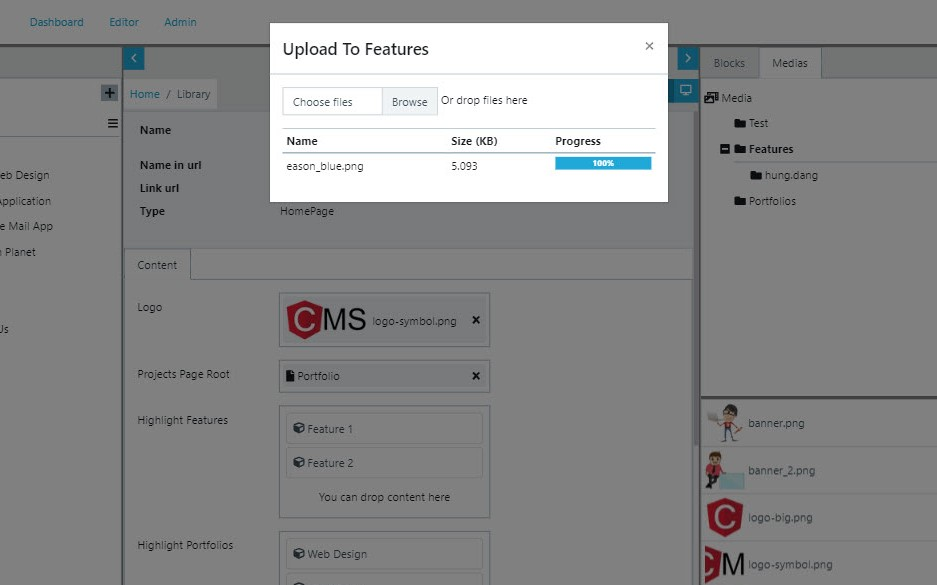

# Angular Cms

The single app CMS based on Angular, Express, NodeJs and MongoDB.

**Status: Working In Progress, not ready to use in production**

## How it work?

Let assume you need build the dynamic website, in Angular CMS, we need to breakdown this page to properties, blocks like this


So thinking of the architecture in which the site which breakdowns to many pages, each page will also breakdowns to blocks and properties. After that we will definite the page types, block types to build the site.

From this idea, in Angular CMS, we will definite the `Home Page` page type like this

```typescript
@PageType({
    displayName: "Home Page",
    componentRef: HomeComponent,
    description: "This is home page type"
})
export class HomePage extends PageData {

    @Property({
        displayName: "Logo",
        displayType: UIHint.Input
    })
    logo: string;

    @Property({
        displayName: "Latest Projects Page Root",
        displayType: UIHint.Input
    })
    latestProjectRoot: string;

    @Property({
        displayName: "Highlight Features",
        description: "This is highlight feature will be in banner area",
        displayType: UIHint.ContentArea
    })
    features: Array<any>;

    @Property({
        displayName: "Highlight Portfolios",
        displayType: UIHint.ContentArea,
    })
    portfolios: Array<any>;

    @Property({
        displayName: "Footer",
        displayType: UIHint.ContentArea
    })
    footer: Array<any>;

    @Property({
        displayName: "Footer Text",
        description: "This is footer text to show the copyright",
        displayType: UIHint.Xhtml
    })
    footerText: string;
}

```

Basically, we have just created the page type with properties: logo, features, portfolios, footer...

Then corresponding to page type, we will create a template (like Html template). In Angular CMS, this template actually is the Angular Component

```typescript
import { Component } from '@angular/core';
import { CmsComponent } from '@angular-cms/core';
import { HomePage } from './home.pagetype';

@Component({
    templateUrl: './home.component.html',
})
export class HomeComponent extends CmsComponent<HomePage> {
    constructor() {
        super();
    }
}

```

Now when create the page with page type of `Home Page`, the `HomeComponent` is charge of rending the page's template

So after we done all things above, how to we create a page. In Angular CMS, we have the admin/editor UI to manage all pages like this

The Editor UI can be accessed via router: http://localhost:4200/cms/editor

The Admin UI can be accessed via router: http://localhost:4200/cms/admin


This Admin/Editor UI is build with plug-in architecture


Each page you created has the unique friendly SEO URL like `/home-page`, `/home-page/about`, `/portfolio/article-1`...and the page is published, it can be access via those urls

Check it out with other nice features:

## Features

1. Page Types, Page Template, Page Properties
2. Block Types, Block Template, Block Properties
3. Media management: Upload multi files (images, doc, pdf, ...), resizing image, drag and drop...
4. Friendly URL
5. SEO (using Angular Universal)
6. Multi site
7. Modules architecture for extend the Admin UI

**and last but most important: the site you build with Angular CMS is actually the Angular App, it mean it is Angular from router, render, .... You will only work with Angular.**

However, it still need a storage to store data, right?. Angular CMS uses the API system which was built by ExpressJS (NodeJS framework) and MongoDB (using mongoose as ORM)

## Screenshots

**The minimal, simple, clear screen for Editor to edit content**


**On page preview**


**Upload media by drag & drop**



**Edit content by drag & drop block into Content area**


**Drop image into Html editor**


**Content tree view with menu and inline edit**


## Prerequisites
Need to install
* Node.js version 12+ or later
* MongoDB

## Module dependency

```mermaid
    graph TD
    A(cms core)-->B(cms modules)
    B-->C(cms portal)
    C-->Z(cms demo)
    X(cms api)-->Z

```

## How to run in dev mode

### Setup Npm Symlinks

For running examples, we need set up the [symlinks](https://docs.npmjs.com/cli/link.html) between modules as below:

1. Go to `cms-api` folders and run command 
```
    npm install
    npm link
``` 

2. Go to `cms-server` folder and run commands

```
    npm link @angular-cms/api
```

### Run in Dev Mode

1. First step, under `cms-server` folder, run the command
```
    npm install
    npm run dev
```
> If you have the issue installing such as the `@angular-cms/api` package is not found, temporary remove it in package.json, run install command then add it again

This command will run script to connect to mongo db, so make sure you have the correct path to your db.
For example, in my local, I have the db path like as `D:/ProgramData/MongoDB/data/db`
```
    mongod --dbpath D:/ProgramData/MongoDB/data/db
```

> If you install the MongoDB and run it as the service in Window, you can skip this step

2. Final step, under `cms` folder, run the command sequentially
```
    npm install
    ng build core
    ng build modules
    ng build portal
    npm run dev
```
> Make sure you installed Angular CLI with `--global`

## Versioning

We are current on Alpha

## Authors

* **Hung Dang Viet** - *Initial work and maintain* - [danghung1202](https://github.com/danghung1202)


## License

This project is licensed under the GNU License - see the [LICENSE](LICENSE) file for details

## Acknowledgments

* Inspiration from Episerver

## Notes


